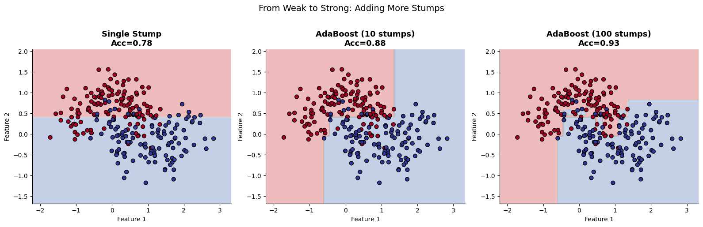
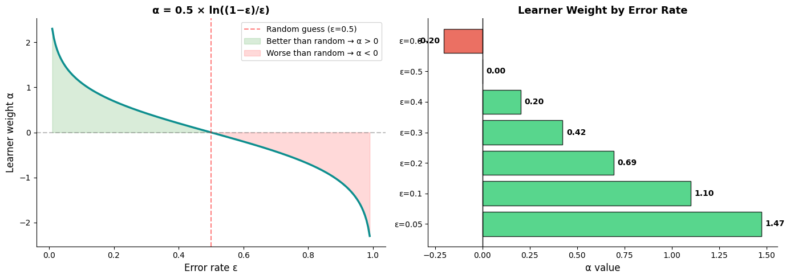
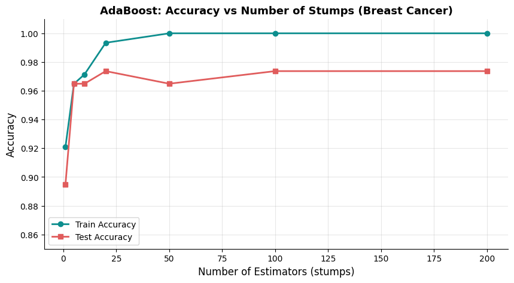
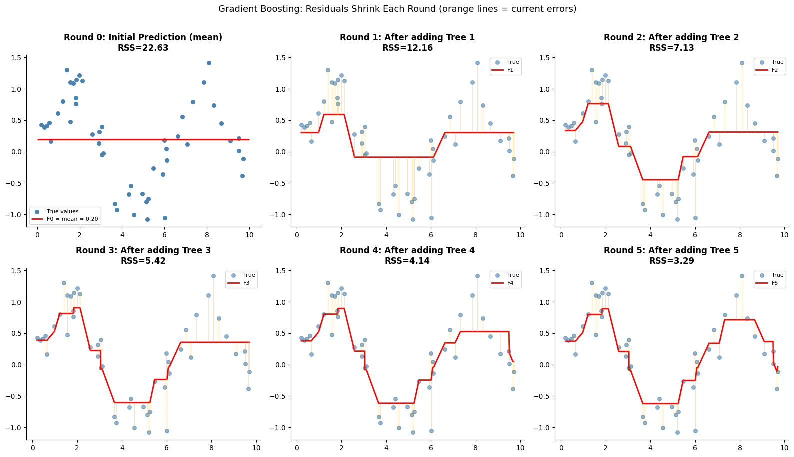
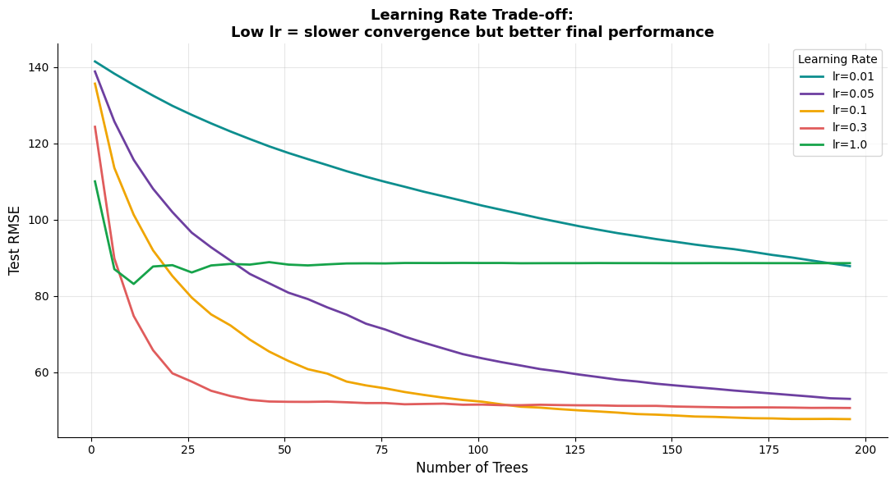
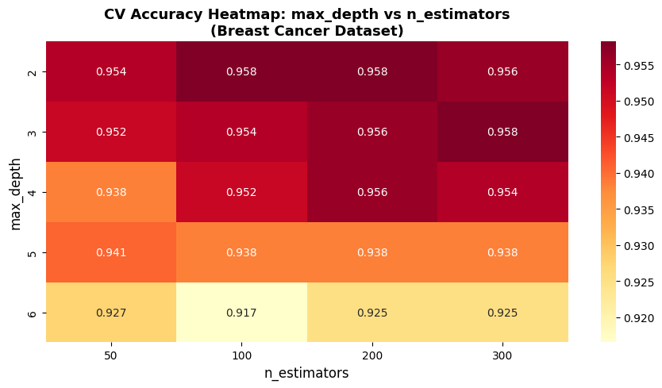
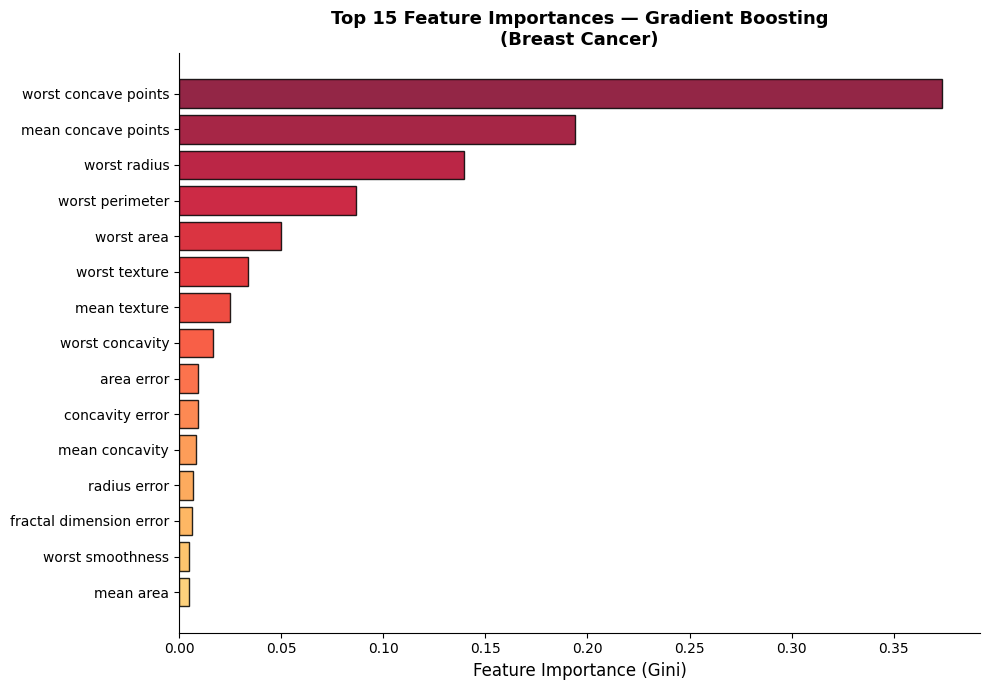
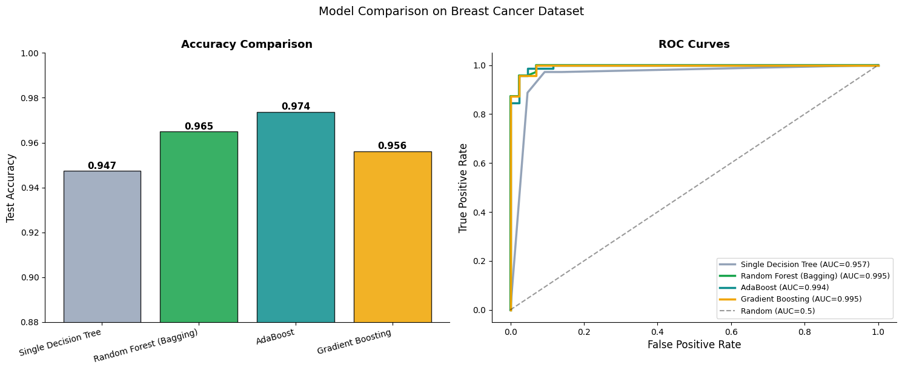

# 🚀 Boosting: AdaBoost & Gradient Boosting

[](https://colab.research.google.com/github/MMujtabaX/Boosting/blob/main/Boosting_Notebook.ipynb)


> **Sequential learners that fix each other's mistakes.** Each new model is trained specifically to correct the errors of the ones before it.

A hands-on walkthrough of boosting: from weak learners to AdaBoost's sample reweighting to Gradient Boosting's residual fitting. The math is visualized step by step, the models are tuned, and everything is compared against bagging on the Breast Cancer Wisconsin dataset.

<p align="center">
  
</p>
<p align="center"><sub>One decision stump (78% accuracy) → 10 boosted stumps (88%) → 100 boosted stumps (93%)</sub></p>

## 📚 What's Covered

| # | Topic | Key idea |
|---|-------|----------|
| 1 | Weak learners | A decision stump (depth-1 tree) is weak alone but powerful in combination |
| 2 | AdaBoost | Reweights misclassified samples; accurate learners get a bigger vote |
| 3 | Gradient Boosting | Each tree fits the **residuals** of the current ensemble |
| 4 | Learning rate | The trade-off between shrinkage and the number of trees |
| 5 | Hyperparameter tuning | `max_depth` × `n_estimators` grid with 5-fold CV |
| 6 | Feature importance | Which features the boosted model relies on |
| 7 | Final comparison | Single tree vs Random Forest vs AdaBoost vs Gradient Boosting |

## ⚖️ Bagging vs Boosting

| | Bagging (e.g. Random Forest) | Boosting |
|--|------------------------------|----------|
| Training | Parallel, independent trees | Sequential, each tree corrects the last |
| Base learners | Deep trees | Shallow trees / stumps |
| Mainly reduces | Variance | Bias |
| Sample weighting | Equal (bootstrap) | Focuses on hard examples |

## 🧮 AdaBoost

Each learner's vote is weighted by its error: **α = ½ · ln((1 − ε) / ε)**. A learner at 50% error (random guessing) gets zero say, and one below 50% gets a positive weight that grows as its error falls.

<p align="center">
  
</p>

On Breast Cancer, test accuracy peaks at **97.4% with just 20 stumps**. Beyond that, training accuracy reaches 100% while test accuracy flattens.

<p align="center">
  
</p>

## 📉 Gradient Boosting: Fitting the Residuals

Starting from the mean, each round fits a small tree to the current errors and adds it with a learning rate η:

$$F_t(x) = F_{t-1}(x) + \eta \cdot h_t(x)$$

On a noisy sine curve, the residual sum of squares falls with every round: **22.63 → 12.16 → 7.13 → 5.42 → 4.14 → 3.29**.

<p align="center">
  
</p>

### Learning rate trade-off

<p align="center">
  
</p>

`lr = 1.0` converges fastest but plateaus at a high error. Smaller learning rates improve steadily and reach much lower error. Within 200 trees, `lr = 0.3` performs best, while `lr = 0.01` is still improving and would need many more trees.

## ⚙️ Tuning & Feature Importance

<table>
  <tr>
    <td></td>
    <td></td>
  </tr>
  <tr>
    <td align="center"><b>Shallow trees (depth 2–3) score best, up to 0.958 CV accuracy; deep trees overfit</b></td>
    <td align="center"><b><code>worst concave points</code> dominates the boosted model</b></td>
  </tr>
</table>

## 📊 Final Comparison: Breast Cancer Wisconsin

<p align="center">
  
</p>

| Model | Test Accuracy | ROC-AUC |
|-------|---------------|---------|
| Single Decision Tree (depth 3) | 0.947 | 0.957 |
| Random Forest (Bagging) | 0.965 | **0.995** |
| **AdaBoost** | **0.974** | 0.994 |
| Gradient Boosting | 0.956 | 0.995 |

## 💡 Key Takeaways

- **All ensembles clearly beat a single tree,** with ROC-AUC rising from 0.957 to about 0.995.
- **AdaBoost had the highest test accuracy** here. Random Forest, AdaBoost and Gradient Boosting are essentially tied on ROC-AUC.
- On a dataset this size, the differences between ensembles are within the noise of a single 114-sample test split. Cross-validation is the fairer way to pick between them.
- **Boosting prefers shallow trees:** depth 2–3 beat deeper trees in tuning.
- **The learning rate and the number of trees must be tuned together.** Smaller rates need more trees.

## 🔮 Next Steps

- Try **XGBoost**, **LightGBM** and **CatBoost**. The notebook uses scikit-learn's `GradientBoostingClassifier`, which implements the same core algorithm, and `xgboost.XGBClassifier` accepts very similar parameters.
- Add early stopping (`n_iter_no_change`) to choose the number of trees automatically.

## 🚀 Run It

Click the **Open in Colab** badge above, or run it locally:

```bash
pip install numpy pandas matplotlib seaborn scikit-learn jupyter
jupyter notebook Boosting_Notebook.ipynb
```

## 👤 Author

**Muhammad Mujtaba Khan Suri** — CS @ UBIT, University of Karachi
[GitHub](https://github.com/MMujtabaX)
